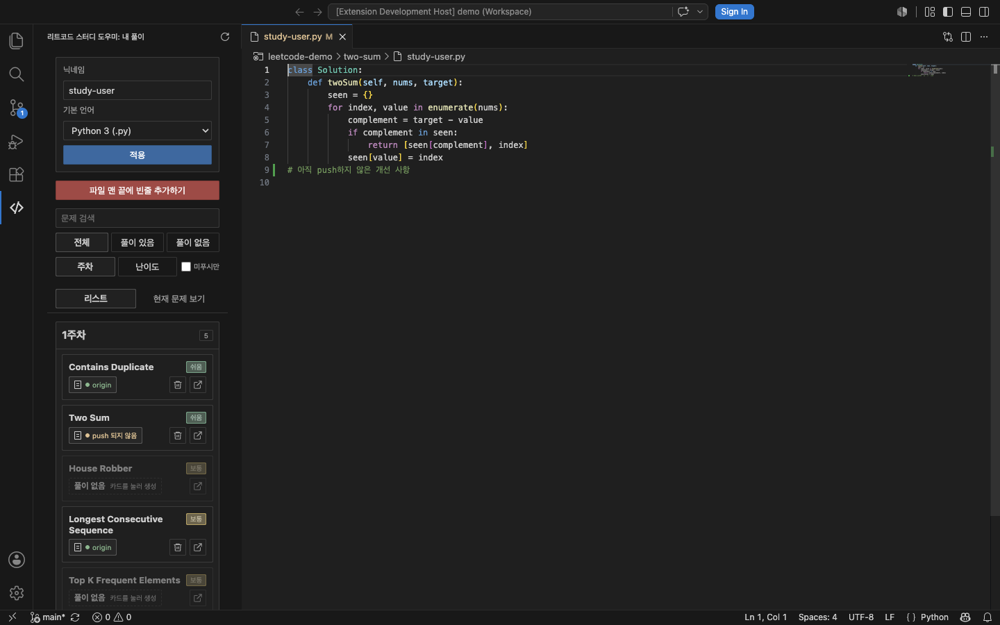
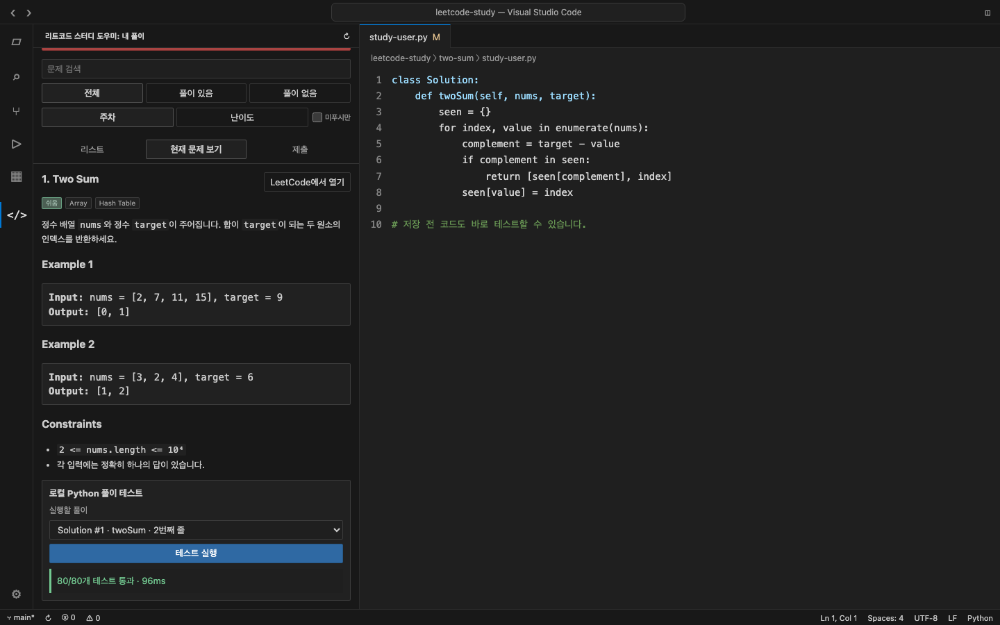

# 리트코드 스터디 도우미

> Find, open, test, and manage your DaleStudy LeetCode solutions without leaving VS Code.

이 확장의 목표는 [DaleStudy/leetcode-study](https://github.com/DaleStudy/leetcode-study) 스터디 저장소에서 문제 탐색, 풀이 파일 관리와 로컬 테스트를 더 쉽고 빠르게 만드는 것입니다. 내 풀이를 바로 찾고, 아직 풀지 않은 문제의 제출 파일을 VS Code 안에서 만들 수 있습니다.



## 핵심 기능

- `problem-categories.json`과 문제 폴더를 감지해 75개 문제를 주차별·난이도별로 정리합니다.
- 닉네임을 기준으로 내 풀이만 찾아 열고, 풀이가 없으면 선택한 언어의 빈 제출 파일을 만듭니다.
- 문제별 **다른 사람 풀이** 버튼으로 다른 참여자의 풀이를 무작위로 열어 비교합니다.
- 현재 브랜치의 upstream을 기준으로 풀이별 `origin` 또는 `push 되지 않음` 상태를 표시하고 미푸시 풀이만 모아 봅니다.
- 풀이 파일을 열면 LeetCode 문제 본문을 사이드바에서 확인하고 문제 페이지로 바로 이동할 수 있습니다.
- 저장하지 않은 현재 Python 코드도 로컬에서 테스트하며, 같은 파일의 여러 `Solution` 구현을 각각 선택할 수 있습니다.
- 멀티 루트 워크스페이스와 파일·Git 변경 자동 갱신을 지원하며, 풀이 삭제와 파일 끝 줄바꿈 일괄 정리도 제공합니다.

## 빠른 시작

1. `problem-categories.json`과 문제 폴더가 있는 스터디 저장소를 VS Code로 엽니다.
2. 활동 표시줄에서 **리트코드 스터디 도우미** 아이콘을 선택합니다.
3. 닉네임과 기본 언어를 입력하고 **적용**을 누릅니다.
4. 문제 카드를 눌러 기존 풀이를 열거나 새 풀이 파일을 만듭니다.
5. 풀이 파일을 연 뒤 **현재 문제 보기**에서 문제 설명과 로컬 테스트를 확인합니다.

닉네임은 파일명의 첫 번째 점 앞부분과 대소문자까지 정확히 비교합니다. 예를 들어 `study-user`는 `study-user.py`와 일치하지만 `Study-User.py`와는 일치하지 않습니다.

## 현재 문제와 로컬 Python 테스트



테스트 러너는 저장 여부와 관계없이 현재 에디터에 보이는 Python 코드를 사용합니다. 같은 이름의 `Solution` 클래스나 대상 메서드가 여러 번 있어도 줄 번호로 구분해 실행할 구현을 선택할 수 있습니다.

`typing`, `array`, `bisect`, `collections`, `functools`, `itertools`, `heapq`, `math` 등 일반적인 LeetCode Python 환경의 라이브러리는 러너가 먼저 import합니다. `ListNode`, `TreeNode`, `Node`, `NestedInteger`처럼 문제별 구조가 필요한 객체는 자동으로 선언하지 않으며, 실제로 필요한 이름이 없으면 실행 전에 안내합니다.

테스트 데이터는 [`newfacade/LeetCodeDataset`](https://huggingface.co/datasets/newfacade/LeetCodeDataset)의 고정 리비전 `215604aeed660029df7de2fea5a4d7b6ed476a08`에서 추출했습니다. 현재 스터디 75문제 중 68문제를 지원하며, 결과는 LeetCode의 공식 실행 또는 제출 결과가 아닙니다.

실행은 신뢰된 워크스페이스에서만 가능하고 10초 후 종료되며 출력은 1MB로 제한됩니다. 별도의 OS 보안 샌드박스가 아니므로 신뢰하는 코드만 실행하세요. 기본 실행기는 `python3`이며 설정에서 다른 실행 파일이나 절대 경로를 지정할 수 있습니다.

## 알아둘 점

- 워크스페이스 루트에 유효한 `problem-categories.json`과 JSON 키에 대응하는 문제 폴더가 하나 이상 있어야 합니다.
- 제출 파일은 문제 폴더 바로 아래에서만 찾으며 `README.md`와 하위 폴더의 파일은 제외합니다.
- 새 풀이를 만들 때 같은 이름 또는 대소문자만 다른 파일이 있으면 덮어쓰지 않고 중단합니다.
- 제한 모드에서는 목록 조회만 지원합니다. 파일 생성·삭제·수정과 로컬 테스트에는 워크스페이스 신뢰가 필요합니다.
- Git 상태는 현재 브랜치의 upstream을 기준으로 계산합니다. Git 저장소가 아니거나 upstream이 없으면 `푸시 상태 확인 불가`로 표시합니다.
- 문제 본문은 처음 요청할 때 LeetCode의 비공식 GraphQL API에서 불러와 확장을 다시 시작하기 전까지 캐시합니다. 네트워크 또는 API 오류가 발생하면 다시 시도하거나 LeetCode 페이지를 직접 열 수 있으며 Premium 문제의 비공개 본문은 표시하지 않습니다.
- **다른 사람 풀이**는 현재 체크아웃에 있는 본인 이외의 제출 파일을 대상으로 하며, 처음 열 때만 풀이 노출 가능성을 확인합니다.
- **파일 맨 끝에 빈줄 추가하기**는 Markdown 제출을 제외하고, 비어 있지 않은 내 제출 파일이 정확히 하나의 `\n`으로 끝나도록 정리합니다.

## 설정

| 설정 | 기본값 | 설명 |
| --- | --- | --- |
| `leetcodeStudyHelper.nickname` | 빈 값 | 제출 파일에서 찾을 닉네임입니다. 영문·숫자·하이픈을 사용할 수 있으며 대소문자를 구분합니다. |
| `leetcodeStudyHelper.preferredLanguage` | `python3` | 새 풀이 파일을 만들 때 사용할 언어와 확장자입니다. |
| `leetcodeStudyHelper.pythonExecutable` | `python3` | Python 테스트에 사용할 실행 파일 또는 절대 경로입니다. |

설정은 전역으로 저장되어 다른 LeetCode Study 워크스페이스에서도 동일하게 사용됩니다.

## 로컬 개발

Node.js `24.18.0`과 Yarn Classic `1.22.22`를 사용합니다.

```sh
nvm use
yarn install
yarn compile
```

주요 검증 명령은 다음과 같습니다.

```sh
yarn lint
yarn typecheck
yarn test:unit
yarn test:integration
yarn test
```

테스트 데이터 동기화에는 `yarn dataset:sync`를 사용합니다. 통합 테스트는 `.tmp`에 격리된 멀티 루트 워크스페이스를 만든 뒤 `@vscode/test-electron`으로 실행합니다.

## VSIX 만들기

```sh
yarn package:vsix
```

모든 검사와 테스트가 성공하면 `.artifacts/leetcode-study-helper.vsix`가 생성됩니다. VS Code의 **Extensions: Install from VSIX...** 명령으로 설치할 수 있습니다.

## 라이선스

[MIT](LICENSE) 라이선스로 배포합니다. 이 프로젝트는 LeetCode 또는 DaleStudy의 공식 제품이 아닙니다.
