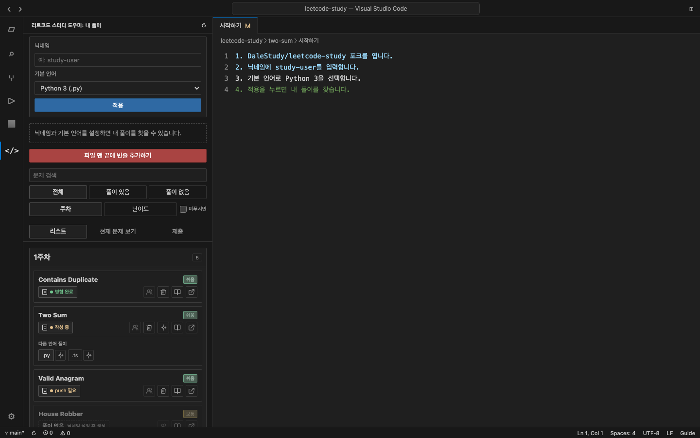
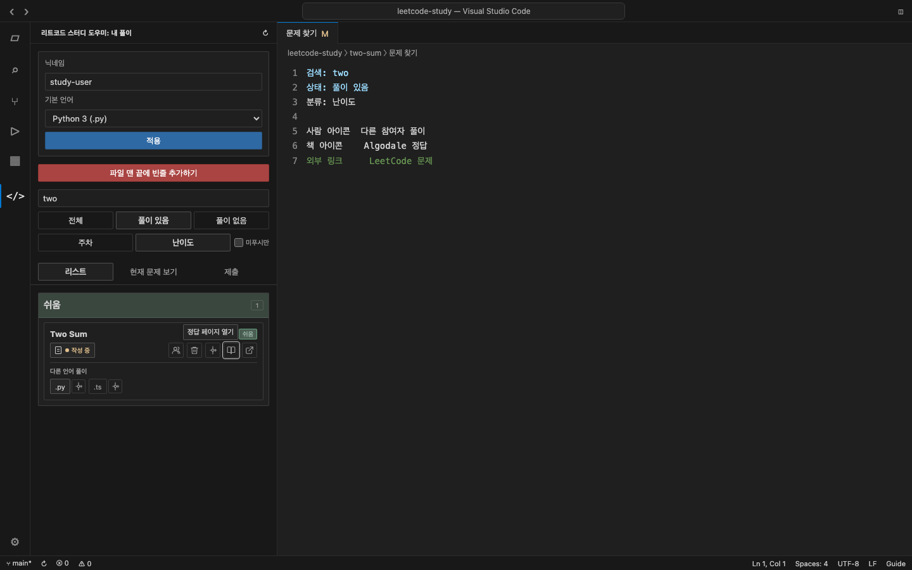
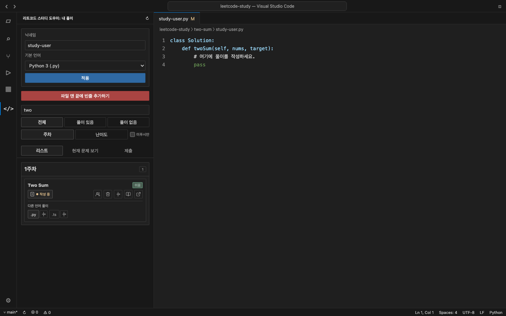
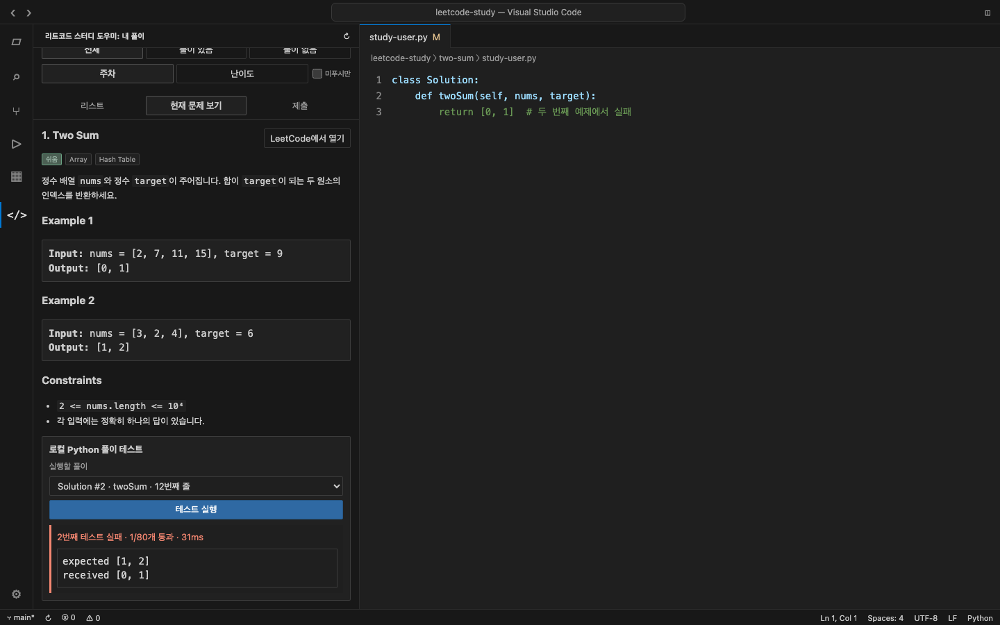
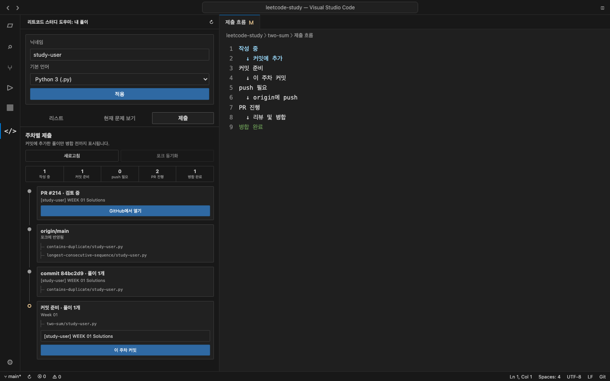
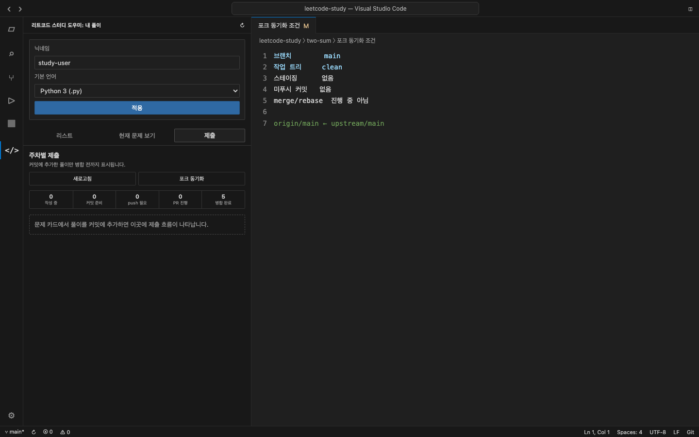

# 리트코드 스터디 도우미 사용법

이 문서는 처음 확장을 사용하는 사람을 기준으로 저장소 준비, 문제 탐색, 풀이 작성과 테스트, 주차별 제출, 포크 동기화까지 순서대로 안내합니다.

문서의 `study-user`와 PR 번호는 익명 예시입니다. 스크린샷은 실제 확장 Webview를 문서용 상태 데이터로 렌더링한 것으로, 실제 GitHub 저장소에는 변경을 만들지 않았습니다.

## 목차

1. [준비하기](#1-준비하기)
2. [닉네임과 기본 언어 설정](#2-닉네임과-기본-언어-설정)
3. [문제 찾기](#3-문제-찾기)
4. [풀이 만들기와 열기](#4-풀이-만들기와-열기)
5. [카드의 보조 기능](#5-카드의-보조-기능)
6. [현재 문제와 Python 테스트](#6-현재-문제와-python-테스트)
7. [주차별로 제출하기](#7-주차별로-제출하기)
8. [포크 동기화](#8-포크-동기화)
9. [문제 해결](#9-문제-해결)

## 1. 준비하기

### 필요한 환경

- VS Code `1.100.0` 이상 또는 해당 API와 호환되는 에디터
- [DaleStudy/leetcode-study](https://github.com/DaleStudy/leetcode-study)의 포크
- 포크를 클론한 로컬 워크스페이스
- 파일 생성, 테스트와 Git 기능을 사용할 경우 신뢰된 워크스페이스
- Python 테스트를 사용할 경우 `python3` 또는 설정한 Python 실행 파일

### 확장 설치

사용하는 에디터에서 **확장 프로그램** 보기를 열고 `리트코드 스터디 도우미`를 검색해 설치합니다.

| 에디터 | 확장 프로그램 스토어 |
| --- | --- |
| VS Code | [Visual Studio Marketplace](https://marketplace.visualstudio.com/items?itemName=alphaorderly.leetcode-study-helper) |
| Cursor·VSCodium 등 Open VSX 사용 에디터 | [Open VSX](https://open-vsx.org/extension/alphaorderly/leetcode-study-helper) |

검색 결과에 바로 나타나지 않으면 정확한 확장 ID로 검색하세요.

```text
@id:alphaorderly.leetcode-study-helper
```

직접 빌드한 VSIX 파일을 설치하려면 명령 팔레트에서 **Extensions: Install from VSIX...**를 실행하고 `.artifacts/leetcode-study-helper.vsix`를 선택합니다.

### 포크와 원격 저장소

GitHub에서 `DaleStudy/leetcode-study`를 자신의 계정으로 포크한 뒤 클론합니다.

```sh
git clone https://github.com/<github-id>/leetcode-study.git
cd leetcode-study
code .
```

제출 기능을 사용하려면 `origin`의 fetch와 push URL이 같은 GitHub 포크를 가리켜야 합니다.

```text
origin  https://github.com/<github-id>/leetcode-study.git (fetch)
origin  https://github.com/<github-id>/leetcode-study.git (push)
```

공식 저장소 remote 이름은 `upstream`이 아니어도 됩니다. fetch 또는 push URL이 `DaleStudy/leetcode-study`이면 그 remote를 사용합니다. 그런 remote가 없으면 **첫 주차 제출**이나 제출 탭의 **공식 저장소 연결**에서 `upstream`으로 `https://github.com/DaleStudy/leetcode-study.git`을 추가합니다. 이때 merge는 하지 않습니다. 포크가 공식 `main`보다 뒤처져 있으면 **포크 동기화**로 맞춥니다. 이름이 `upstream`인데 다른 저장소를 가리키면 안전을 위해 동기화를 중단합니다.

워크스페이스 루트에는 다음 항목이 있어야 합니다.

```text
leetcode-study/
├── problem-categories.json
├── two-sum/
│   ├── README.md
│   └── ...
└── ...
```

확장은 `problem-categories.json`의 문제 키와 실제 문제 폴더를 함께 확인합니다. 유효한 문제 폴더가 하나도 없으면 지원되는 워크스페이스로 인식하지 않습니다.

## 2. 닉네임과 기본 언어 설정

활동 표시줄에서 **리트코드 스터디 도우미** 아이콘을 선택합니다.



1. **닉네임**에 제출 파일명의 첫 번째 부분을 입력합니다.
2. **기본 언어**에서 새 풀이에 사용할 언어를 선택합니다.
3. **적용**을 누릅니다.

예를 들어 닉네임이 `study-user`이고 기본 언어가 `Python 3 (.py)`라면 새 풀이 파일은 다음처럼 만들어집니다.

```text
two-sum/study-user.py
```

닉네임에는 영문, 숫자, 하이픈만 사용할 수 있고 대소문자를 구분합니다.

| 닉네임 | 파일명 | 결과 |
| --- | --- | --- |
| `study-user` | `study-user.py` | 내 풀이로 인식 |
| `study-user` | `study-user.ts` | 내 다른 언어 풀이로 인식 |
| `study-user` | `Study-User.py` | 다른 이름으로 인식 |
| `study-user` | `study-user.extra.py` | 첫 번째 점 앞부분이 같으므로 내 풀이로 인식 |

설정은 VS Code 전역 설정으로 저장되므로 다른 LeetCode Study 워크스페이스를 열어도 동일하게 적용됩니다.

## 3. 문제 찾기

기본 목록은 문제를 주차별로 보여 줍니다. 상단 컨트롤을 조합하면 필요한 문제만 남길 수 있습니다.



- **문제 검색**: 표시 제목을 기준으로 문제를 좁힙니다. `two`를 입력하면 `Two Sum`처럼 일치하는 문제만 남습니다.
- **전체 / 풀이 있음 / 풀이 없음**: 내 풀이 파일 존재 여부로 필터링합니다.
- **주차 / 난이도**: 문제를 스터디 주차 또는 쉬움·보통·어려움으로 다시 묶습니다.
- **미푸시만**: 현재 브랜치의 upstream에 반영되지 않은 내 풀이만 표시합니다.

문제 상태에는 다음처럼 확인된 정보만 표시됩니다.

| 상태 | 의미 |
| --- | --- |
| `작성 중` | 로컬 풀이에 아직 제출되지 않은 변경이 있습니다. |
| `커밋 준비` | 확장에서 선택해 스테이징한 풀이입니다. |
| `push 필요` | 로컬 커밋이 `origin`에 반영되지 않았습니다. |
| `PR 필요` | 포크에는 반영됐지만 열린 PR이 없습니다. |
| `PR #… 진행 중` | 해당 풀이가 열린 PR에 포함돼 있습니다. |
| `병합 완료` | 공식 저장소에서 같은 풀이 경로를 확인했습니다. |
| `동기화 후 확인` | 포크가 공식 저장소보다 뒤처져 현재 상태를 확정할 수 없습니다. |
| `상태 확인 불가` | Git 또는 GitHub 정보를 확인할 수 없습니다. |

## 4. 풀이 만들기와 열기

풀이가 없는 문제 카드를 누르면 현재 닉네임과 기본 언어로 새 파일을 만듭니다.



예를 들어 `Two Sum` 카드를 누르면 다음 파일이 생성되고 에디터에서 열립니다.

```text
two-sum/study-user.py
```

이미 풀이가 있다면 카드는 기본 언어의 풀이를 우선해서 엽니다. 같은 문제에 `study-user.py`와 `study-user.ts`가 모두 있으면 카드 아래의 `.py`, `.ts` 버튼으로 원하는 파일을 직접 열 수 있습니다.

안전을 위해 다음 경우에는 새 파일을 만들지 않습니다.

- 닉네임이 설정되지 않은 경우
- 워크스페이스가 신뢰되지 않은 경우
- 같은 이름의 파일이 이미 있는 경우
- 대소문자만 다른 파일이 있는 경우
- 대상 문제 폴더가 워크스페이스 밖을 가리키는 경우

문제 폴더의 바로 아래에 있는 제출 파일만 풀이로 인식합니다. `README.md`와 하위 폴더의 파일은 제외합니다.

## 5. 카드의 보조 기능

문제 카드 오른쪽 아이콘은 마우스를 올리거나 키보드로 포커스하면 기능 설명을 보여 줍니다.

| 아이콘 | 동작 |
| --- | --- |
| 사람 | 현재 체크아웃에 있는 다른 참여자의 풀이 하나를 무작위로 엽니다. |
| 휴지통 | 내 풀이 파일을 확인 후 삭제합니다. |
| Git 추가 | 풀이를 이번 주차 커밋에 추가하거나 뺍니다. |
| 책 | 문제 폴더의 `README.md`에서 확인한 Algodale 정답 페이지를 엽니다. |
| 외부 링크 | LeetCode 문제 페이지를 기본 브라우저로 엽니다. |

**다른 참여자 풀이**는 현재 닉네임과 같은 파일을 제외하고, 가능하면 기본 언어의 풀이를 선택합니다. 처음 사용할 때는 풀이가 노출될 수 있음을 확인합니다.

**Algodale 정답 페이지**는 검증된 HTTPS 링크를 찾은 경우에만 활성화됩니다. 책 아이콘을 누를 때마다 `정답으로 이동합니다.` 확인을 거친 뒤 외부 브라우저로 이동합니다.

## 6. 현재 문제와 Python 테스트

풀이 파일을 열면 **현재 문제 보기** 탭이 활성화됩니다.


현재 문제 화면에서 확인할 수 있는 내용은 다음과 같습니다.

- LeetCode 문제 제목, 난이도와 주제 태그
- 공개된 문제 본문, 예제와 제약
- LeetCode 문제 페이지 링크
- 실행할 Python `Solution` 구현 선택
- 통과·실패한 테스트 수, 실행 시간, 출력과 오류

러너는 디스크에 마지막으로 저장한 코드가 아니라 현재 에디터에 보이는 코드를 사용합니다. 저장하지 않은 변경도 바로 테스트할 수 있습니다.

같은 이름의 `Solution` 클래스나 대상 메서드가 여러 개면 줄 번호가 포함된 목록에서 실행할 구현을 선택합니다.

```text
Solution #1 · twoSum · 2번째 줄
Solution #2 · twoSum · 12번째 줄
```

실패하면 첫 실패 테스트와 비교 결과를 표시합니다.



Python 러너의 주요 제약은 다음과 같습니다.

- 신뢰된 워크스페이스에서만 실행합니다.
- 기본 실행 파일은 `python3`이며 `leetcodeStudyHelper.pythonExecutable`에서 변경할 수 있습니다.
- 실행은 10초 후 종료되고 stdout·stderr를 합쳐 1MB로 제한합니다.
- 별도의 OS 보안 샌드박스가 아니므로 신뢰하는 코드만 실행해야 합니다.
- 75개 스터디 문제 중 데이터가 준비된 68개 문제만 지원합니다.
- `ListNode`, `TreeNode`, `Node`, `NestedInteger` 등 문제별 객체가 필요하지만 코드에 정의되지 않았다면 실행 전에 안내합니다.
- 이 결과는 LeetCode의 공식 실행 또는 제출 결과가 아닙니다.

## 7. 주차별로 제출하기

제출 기능은 GitHub에서 `DaleStudy/leetcode-study`의 포크로 확인된 저장소에서 동작합니다. 새 주차 브랜치는 공식 `main` tip에서 만들고, 커밋 이후에는 해당 `week-XX` 브랜치에서 이어집니다. 포크 `main`이 공식 저장소보다 앞서 있어도(GitHub Sync merge 등) 주차 브랜치의 기준은 공식 `main`입니다. 공식 remote가 없거나 포크가 뒤처져 있으면 제출 탭에 **공식 저장소 연결**이 나타납니다.

### 1단계: 커밋에 추가

문제 카드의 Git 추가 아이콘에 포커스하면 **커밋에 추가** 설명이 나타납니다. 버튼을 누르면 해당 풀이만 스테이징되고 상태가 `커밋 준비`로 바뀝니다.

스테이징 후 파일을 다시 수정하면 `추가 수정 있음`으로 표시됩니다. 최신 내용을 포함하려면 같은 버튼으로 다시 추가해야 합니다.

### 2단계: 주차 커밋

**제출** 탭에서 스테이징 파일과 주차를 확인합니다.



기본 커밋 메시지는 닉네임과 활성 주차로 만들어집니다.

```text
[study-user] WEEK 01 Solutions
```

메시지를 확인하고 **이 주차 커밋**을 누릅니다. 확장은 `week-01` 형식의 브랜치를 공식 `main` tip에서 자동으로 생성하고 전환한 뒤 커밋합니다. 같은 이름의 브랜치가 이미 있으면 로컬·원격 tip이 일치하고, 공식 `main` tip을 포함하며, 해당 주차 풀이만 있는 경우에만 재사용합니다. 공식 `main`에 없는 과거 커밋이나 merge가 섞인 `week-XX`는 자동 rebase하지 않고 재사용을 거부합니다.

커밋 직전에는 다음 조건을 다시 검사합니다.

- 실제 Git index가 화면의 풀이 목록과 정확히 일치하는지
- `main`이 `origin/main`과 같고 공식 `main`을 포함하는지
- 기존 주차 브랜치가 공식 `main`에서 이어지고, `공식 main..HEAD` 범위에 다른 주차·풀이 외 변경·merge 커밋이 없는지

### 3단계: origin에 push

로컬 커밋이 생기면 `origin/week-XX` 노드에 **origin에 push** 버튼이 표시됩니다. push 전에는 다음 조건을 다시 확인합니다.

- 현재 브랜치가 활성 주차와 일치하는 `week-XX`인지
- 최초 push는 `공식 main..HEAD`, 후속 push는 `origin/week-XX..HEAD` 범위가 안전한지
- 그 범위에 merge 커밋이 없고, 모든 미푸시 커밋이 같은 주차의 풀이만 포함하는지
- 다른 주차나 풀이 외 파일이 섞이지 않았는지

조건을 만족하면 일반 push를 실행합니다. force push는 사용하지 않습니다.

### 4단계: PR 작성

push가 끝나면 **PR 작성 화면 열기**를 누릅니다. 확장은 다음 내용을 채운 GitHub 비교 페이지를 기본 브라우저로 엽니다.

```text
제목: [study-user] WEEK 01 Solutions
대상: DaleStudy/leetcode-study:main
소스: study-user/leetcode-study:week-01
```

PR이 열리면 제출 탭에 PR 번호와 제목이 나타납니다. 확장은 PR을 직접 생성하지 않으며, GitHub 화면에서 최종 내용을 확인하고 사용자가 제출합니다.

한 주차의 열린 PR이나 공식 저장소에 아직 반영되지 않은 파일이 남아 있으면 다른 주차 제출은 잠깁니다. 여러 주차가 이미 포크에 섞여 있다면 자동으로 합치지 않습니다.

PR이 병합되고 주차 브랜치에 변경이나 미푸시 커밋이 없으면 **main으로 돌아가 동기화** 버튼이 활성화됩니다. 이 버튼은 `main`으로 전환한 뒤 포크 동기화를 실행하며 로컬·원격 `week-XX` 브랜치는 삭제하지 않습니다. 병합 없이 닫힌 PR은 자동 복귀 대상으로 취급하지 않습니다.

## 8. 포크 동기화

공식 저장소의 변경을 포크에 반영하려면 **제출** 탭의 **포크 동기화**를 사용합니다. 아직 제출 흐름이 없을 때는 **공식 저장소 연결**이 같은 동작을 합니다.

`main`이 깨끗하고 origin과 분기되지 않았다면, 문제 카드에서 **커밋에 추가**할 때도 같은 동기화를 먼저 실행한 뒤 스테이징을 이어갑니다. GitHub 웹의 Sync fork를 누르지 않아도 됩니다.



버튼은 다음 조건을 만족할 때 활성화됩니다.

- 현재 브랜치가 `main`
- 스테이징된 변경 없음
- 추적 중인 파일의 작업 트리 변경 없음
- origin보다 앞선 로컬 커밋이 없음 (`origin/main`을 아직 비교하지 못한 경우에는 끄지 않습니다)
- merge 또는 rebase가 진행 중이지 않음

동기화 순서는 다음과 같습니다.

1. `origin/main`을 fetch합니다.
2. 로컬 `main`이 `origin/main`보다 뒤처졌다면 먼저 병합합니다.
3. 공식 저장소를 가리키는 remote가 없으면 `upstream`으로 추가하고, 이미 있으면 그 이름을 사용합니다.
4. 해당 remote의 `main`을 fetch하고 필요한 경우 병합합니다.
5. 결과가 `origin/main`에서 이어지는지 확인합니다.
6. upstream 추적 설정이 없다면 `main → origin/main`으로 설정합니다.
7. 일반 push로 `origin/main`을 갱신합니다.

충돌이 발생하면 진행 중인 merge를 중단하고 원래 상태로 돌아갑니다. rebase, force push, 자동 stash는 사용하지 않습니다. 추적되지 않은 새 풀이 파일은 자동 stash하거나 삭제하지 않습니다. 로컬이 origin보다 앞서 있거나 서로 분기되어 있으면 동기화하지 않습니다.

## 9. 문제 해결

| 증상 | 확인할 내용 |
| --- | --- |
| `지원되는 워크스페이스를 찾지 못했습니다` | 루트에 유효한 `problem-categories.json`과 키에 대응하는 문제 폴더가 있는지 확인합니다. |
| 닉네임 적용 후 내 풀이가 보이지 않음 | 파일명의 첫 번째 점 앞부분과 닉네임의 대소문자가 정확히 같은지 확인합니다. |
| 새 풀이를 만들 수 없음 | 닉네임, 워크스페이스 신뢰, 같은 이름 또는 대소문자만 다른 파일을 확인합니다. |
| `푸시 상태 확인 불가` | Git 저장소인지, 현재 브랜치에 upstream이 설정되어 있는지 확인합니다. |
| 제출 탭에서 포크를 지원하지 않는다고 표시 | `origin` fetch·push URL이 같은 GitHub 포크를 가리키고, 해당 포크가 `DaleStudy/leetcode-study`에서 만들어졌는지 확인합니다. |
| 제출 탭에 GitHub API 한도 / 로그인 안내 | 제출 탭의 **GitHub으로 로그인**을 눌러 VS Code GitHub 계정으로 인증합니다. 에디터에 이미 GitHub 로그인이 되어 있으면 자동으로 사용합니다. |
| `풀이 외 파일이 스테이징되어 있습니다` | Source Control에서 풀이가 아닌 파일을 스테이징 해제한 뒤 새로고침합니다. |
| `공식 저장소에 반영되지 않은 풀이가 여러 주차에 걸쳐 있습니다` | 기존 주차의 PR과 병합을 먼저 완료합니다. 확장은 여러 주차를 자동으로 합치지 않습니다. |
| `origin에 push하지 않은 로컬 커밋` / `로컬 main과 origin/main이 서로 분기` | 로컬 전용 커밋을 먼저 정리합니다. 확장은 force push하지 않습니다. |
| `스테이징 또는 추적 파일 변경을 정리한 뒤 포크를 동기화` | Source Control에서 추적 파일 수정을 정리한 뒤 `main`에서 다시 커밋에 추가하거나 **포크 동기화**를 실행합니다. |
| 포크 동기화 버튼이 비활성화됨 | `main`이 아닌 브랜치, 스테이징·추적 파일 수정, origin보다 앞선 로컬 커밋, merge·rebase 상태를 확인합니다. 제출 탭 본문과 버튼 툴팁에 이유가 표시됩니다. untracked 풀이만 있는 경우에는 막히지 않습니다. |
| 기존 `week-XX` 브랜치를 자동 재사용할 수 없음 | 로컬·원격 tip이 일치하고 공식 `main`에서 이어지며 해당 주차 풀이만 포함해야 합니다. 오염된 브랜치는 자동 rebase하지 않으므로, 공식 `main` tip에서 새로 만든 뒤 해당 주차만 다시 커밋합니다. |
| `공식 main이 아닌 merge 히스토리가 포함` | GitHub Sync merge 등으로 더러워진 주차 브랜치입니다. 확장은 rebase하거나 fork `main`을 force-reset하지 않습니다. 공식 `main` tip에서 새 브랜치를 만들어 해당 주차만 다시 커밋합니다. |
| **main으로 돌아가 동기화**가 비활성화됨 | PR 병합 여부와 주차 브랜치의 스테이징·작업 트리·미푸시 커밋을 확인합니다. |
| Python 테스트를 사용할 수 없음 | 지원 문제인지, 파일이 Python인지, 실행 파일 경로가 유효한지, 필요한 문제별 객체가 정의됐는지 확인합니다. |
| 문제 본문을 불러오지 못함 | 네트워크와 LeetCode API 상태를 확인하고 다시 시도하거나 **LeetCode에서 열기**를 사용합니다. |

### 설정에서 Python 실행 파일 바꾸기

VS Code 설정에서 `leetcodeStudyHelper.pythonExecutable`을 변경합니다.

```json
{
  "leetcodeStudyHelper.pythonExecutable": "/absolute/path/to/python3"
}
```

명령 이름이나 절대 경로를 사용할 수 있습니다. 실행 파일을 시작할 수 없으면 러너가 오류 메시지를 표시합니다.

### 새로고침

파일이나 Git 상태가 즉시 반영되지 않았다면 보기 제목의 새로고침 아이콘을 누릅니다. 제출 상태를 GitHub에서 다시 확인하려면 **제출** 탭의 **새로고침**을 사용합니다.

---

[README로 돌아가기](README.md)
